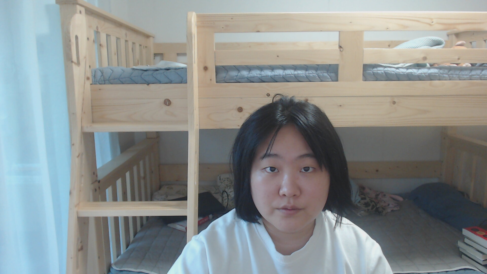

# 사진에 스티커 붙여보기



이런 일반 얼굴 사진에


위 사진과 같이 사진에 고양이 수염을 붙여볼 것입니다.

## 라이브러리 `import`하기

```python
import cv2
import matplotlib.pyplot as plt
import numpy as np
import os
import dlib
import re
```

cv2 - 이미지 처리
matplotlib - 진행하면서 이미지를 볼 수 있기 위해

numpy - 이미지를 numpy array 형태로 사용하기 위해

os - 이미지의 path를 지정하기 위해

dlib - 얼굴 인식을 위해

re - 파일명 처리 정규표현식 때문에 (없어도 무방함)

##  add_whiskers 함수 구현하기

```python
def add_whiskers(img_path, sticker_path, detector_hog, landmark_predictor):
    img_bgr = cv2.imread(img_path, cv2.IMREAD_UNCHANGED)    #- OpenCV로 이미지를 읽어서
    img_bgr = cv2.resize(img_bgr, (640, 360))    # 640x360의 크기로 Resize
    img_rgb = cv2.cvtColor(img_bgr, cv2.COLOR_BGR2RGB)
    img_show= cv2.cvtColor(img_bgr, cv2.COLOR_BGRA2RGBA) #- 출력용 이미지 별도 보관
    dlib_rect = detector_hog(img_rgb, 1)[0]   #- (image, num of img pyramid)
    list_landmarks = []
    points = landmark_predictor(img_rgb, dlib_rect)
    list_points = list(map(lambda p: (p.x, p.y), points.parts()))
    list_landmarks.append(list_points)
    x = list_landmarks[0][30][0]
    y = list_landmarks[0][30][1] + dlib_rect.height() // 20
    w = dlib_rect.width()
    h = dlib_rect.height()
    img_sticker = cv2.imread(sticker_path, cv2.IMREAD_UNCHANGED)
    sticker_rgb = cv2.cvtColor(img_sticker, cv2.COLOR_BGRA2RGBA)
    img_sticker = cv2.resize(img_sticker, (w,h), fx=0.5, fy=0.5, interpolation = cv2.INTER_AREA)
    refined_x = x - w // 2
    refined_y = y - h // 2
    sticker_area = img_show[refined_y:refined_y+img_sticker.shape[0], refined_x:refined_x+img_sticker.shape[1]]
    img_show[refined_y:refined_y+img_sticker.shape[0], refined_x:refined_x+img_sticker.shape[1]] = np.where(img_sticker>=[100,100,100,0], sticker_area, cv2.addWeighted(img_sticker, 0.4, sticker_area, 0.6, 0))
    plt.imshow(img_show)
    cv2.imwrite(os.getenv('HOME')+'/AIFFEL/2021-09-30/images/Results/'+re.search(r'photo[0-9]\.jpg',image_path).group(), cv2.cvtColor(img_show, cv2.COLOR_RGB2BGR))
```

## 얼굴 인식기 인스턴스 및 각종 변수 선언

```python
num_of_images = 8
detector_hog = dlib.get_frontal_face_detector()
model_path = os.getenv('HOME')+'/AIFFEL/2021-09-30/models/shape_predictor_68_face_landmarks.dat'
landmark_predictor = dlib.shape_predictor(model_path)
sticker_path = os.getenv('HOME')+'/AIFFEL/2021-09-30/images/cat-whiskers.png'
for i in range(1, num_of_images+1):
    plt.figure(figsize=(640, 360))
    plt.subplot(1, num_of_images, i)
    image_path = os.getenv('HOME')+'/AIFFEL/2021-09-30/images/Webcam/photo'+str(i)+'.jpg'
    add_whiskers(image_path, sticker_path, detector_hog, landmark_predictor)
```

## 문제점과 해결방안 고민


얼굴을 한 쪽으로 좀 많이 돌렸더니 잘못된 영역이 인식되는 것을 볼 수 있습니다. [OpenCV 정보 사이트](https://learnopencv.com/face-detection-opencv-dlib-and-deep-learning-c-python/)에 따르면 `dlib`의 `get_frontal_face_detector()` 자체가 frontal이 아닌, 많이 틀어져 있는 얼굴은 인식을 하지 못한다고 합니다. 얼굴의 각도가 달라져도 인식이 잘 되는 라이브러리로는 OpenCV의 DNN Face Detector가 있다고 합니다. 나중에 DNN Face Detector와 OpenCV의 사용법을 더 익혀서 다시 적용해 봐야겠습니다.
