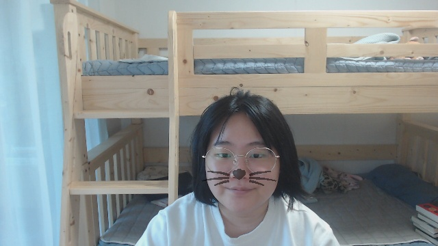

# 사진에 스티커 붙여보기


이런 일반 얼굴 사진에


위와 같이 고양이 수염을 붙여볼 것입니다.

고양이 수염 파일은 [flaticon.com](https://www.flaticon.com/free-icon/cat-whiskers_24674)에서 가져왔습니다.

## 라이브러리 `import`하기

```python
import cv2
import matplotlib.pyplot as plt
import numpy as np
import os
import dlib
import re
```

cv2 - 이미지 처리
matplotlib - 진행하면서 이미지를 볼 수 있기 위해

numpy - 이미지를 numpy array 형태로 사용하기 위해

os - 이미지의 path를 지정하기 위해

dlib - 얼굴 인식을 위해

re - 이미지 저장 파일명을 처리하기 위한 정규표현식 (파일을 저장하지 않는다면 관련 코드를 삭제해도 무방합니다.)

##  add_sticker 함수 구현하기

```python
ddef add_sticker(img_path, sticker_path, detector_hog, landmark_predictor, results_path):
    img_bgr = cv2.imread(img_path, cv2.IMREAD_UNCHANGED)
    img_bgr = cv2.resize(img_bgr, (640, 360))
    img_rgb = cv2.cvtColor(img_bgr, cv2.COLOR_BGR2RGB)
    img_rgba = cv2.cvtColor(img_bgr, cv2.COLOR_BGRA2RGBA)
    dlib_rect = detector_hog(img_rgb, 1)[0]
    list_landmarks = []
    points = landmark_predictor(img_rgb, dlib_rect)
    list_points = list(map(lambda p: (p.x, p.y), points.parts()))
    list_landmarks.append(list_points)
    x = list_landmarks[0][30][0]
    y = list_landmarks[0][30][1] + dlib_rect.height() // 20
    w = dlib_rect.width()
    h = dlib_rect.height()
    refined_x = x - w // 2
    refined_y = y - h // 2
    img_sticker = cv2.imread(sticker_path, cv2.IMREAD_UNCHANGED)
    img_sticker = cv2.cvtColor(img_sticker, cv2.COLOR_BGRA2RGBA)
    img_sticker = cv2.resize(img_sticker, (w,h))
    sticker_area = img_rgba[refined_y:refined_y+img_sticker.shape[0], refined_x:refined_x+img_sticker.shape[1]]
    for row in img_sticker:
        for pixel in row:
            if pixel[-1] < 100:
                pixel[:2] = 255
                pixel[3] = 0
    img_rgba[refined_y:refined_y+img_sticker.shape[0], refined_x:refined_x+img_sticker.shape[1]] = np.where(img_sticker==[255,255,255,0], sticker_area, cv2.addWeighted(img_sticker, 0.5, sticker_area, 0.5, 0))
    plt.imshow(img_rgba)
    cv2.imwrite(results_path + re.search(r'photo[0-9]\.png',image_path).group(), cv2.cvtColor(img_rgba, cv2.COLOR_RGBA2BGRA))
```
### 얼굴 이미지 불러와서 크기와 컬러스페이스 조정하기
```python
img_bgr = cv2.imread(img_path, cv2.IMREAD_UNCHANGED)
img_bgr = cv2.resize(img_bgr, (640, 360))
img_rgb = cv2.cvtColor(img_bgr, cv2.COLOR_BGR2RGB)
img_rgba = cv2.cvtColor(img_bgr, cv2.COLOR_BGRA2RGBA)
```

`img_rgb`와 `img_rgba`가 따로 있는 이유는 `dlib.get_frontal_face_detector`는 RGB 채널만 받을 수 있는 반면에 알파(투명도) 채널이 같이 있는 스티커 이미지와 같이 처리하려면 똑같이 알파 채널이 있는 이미지여야 에러가 나지 않기 때문입니다. 얼굴 위치 인식에는 `img_rgb`를, 스티커 합성에는 `img_rgba`를 사용합니다. 같은 이미지이므로 얼굴 위치는 동일하기 때문에 문제는 없습니다.

### 얼굴 영역과 영역 내 이목구비(landmarks) 인식하기
```python
dlib_rect = detector_hog(img_rgb, 1)[0]
list_landmarks = []
points = landmark_predictor(img_rgb, dlib_rect)
list_points = list(map(lambda p: (p.x, p.y), points.parts()))
list_landmarks.append(list_points)
```
### 스티커 위치 지정하기
```python
x = list_landmarks[0][30][0]
y = list_landmarks[0][30][1] + dlib_rect.height() // 20
w = dlib_rect.width()
h = dlib_rect.height()
refined_x = x - w // 2
refined_y = y - h // 2
```
우선 코의 위치인 30번 랜드마크를 기준으로 `x`와 `y`를 정합니다. `y`의 경우 랜드마크 위치보다 살짝 아래로 내리는 게 더 코 위치에 맞는 것 같아 직사각형 높이의 1/20만큼 내려주었습니다. 그 다음 얼굴 크기에 맞게 너비와 높이를 정해줍니다. `refined_x`와 `refined_y`를 높이/너비의 반을 뺀 값으로 정의하는 이유는 랜드마크 위치가 실제로 스티커가 들어갈 자리의 중앙이며 이를 왼쪽 위로 맞춰주기 위함입니다.

### 스티커 이미지 불러와서 사이즈와 컬러 스페이스 조정하기
```python
img_sticker = cv2.imread(sticker_path)
img_sticker = cv2.cvtColor(img_sticker, cv2.COLOR_BGR2RGB)
img_sticker = cv2.resize(img_sticker, (w,h))
```

### 투명 픽셀 통일하기
```python
for row in img_sticker:
    for pixel in row:
        if pixel[-1] < 100:
            pixel[:2] = 255
            pixel[3] = 0
```
투명한 지역은 투명해서 보이지 않지만 실제 RGB 값은 255, 255, 255일수도 0, 0, 0일수도 있습니다. 예시로 사용된 고양이 수염 이미지는 투명한 지역이 255, 255, 255, 0이지만 다른 스티커 이미지를 사용할 경우 그렇지 않을 수도 있다는 말이죠. 다른 스티커 이미지를 사용할 때의 확장성 그리고 스티커 합성 처리할 때의 편의성을 위해 투명한 픽셀(즉 알파 값이 특정 값 미만인 픽셀, 여기서 특정 값은 임의로 100으로 지정)의 경우 [255, 255, 255, 0]으로 통일해줍니다.

### 스티커 영역을 정의해 스티커 붙이기
```python
sticker_area = img_rgb[refined_y:refined_y+img_sticker.shape[0], refined_x:refined_x+img_sticker.shape[1]]
img_rgb[refined_y:refined_y+img_sticker.shape[0], refined_x:refined_x+img_sticker.shape[1]] = np.where(img_sticker==[255, 255, 255, 0], sticker_area, cv2.addWeighted(img_sticker, 0.5, sticker_area, 0.5, 0))
```
스티커가 들어갈 자리의 위쪽 가장자리(`refined_y`)부터 아래쪽 가장자리(`refined_y+img_sticker.shape[0]`)까지, 그리고 왼쪽 가장자리(`refined_x`)부터 오른쪽 가장자리(`refined_x+img_sticker.shape[1]`)까지 스티커 영역을 지정해주고, 스티커 영역 내에서 `img_sticker`의 픽셀 값이 [255, 255, 255, 0]인 경우 (아까 투명 픽셀 값을 그렇게 통일해 주었죠?) `sticker_area`의 값을 그대로, 그렇지 않은 경우 (즉 스티커의 투명한 지역이 아닌 실제 스티커 부분인 경우) `img_sticker`와 `sticker_area`를 반반 합성한 값을 넣어줍니다. 그냥 `img_sticker`를 넣지 않는 이유는 자연스럽게 블렌딩을 하기 위해서인데요, 블렌딩을 하지 않고 스티커가 튀게 하려면 `cv2.addWeighted(img_sticker, 0.5, sticker_area, 0.5, 0)` 부분을 `img_sticker`로 대체할 수 있습니다.


## 얼굴 인식기 인스턴스 및 각종 변수 선언

```python
num_of_images = 8
detector_hog = dlib.get_frontal_face_detector()
dir_path = os.getenv('HOME')+'/AIFFEL/2021-09-30'
model_path = dir_path + '/models/shape_predictor_68_face_landmarks.dat'
landmark_predictor = dlib.shape_predictor(model_path)
sticker_path = dir_path + '/images/cat-whiskers.png'
results_path = dir_path + '/images/Results/'
for i in range(1, num_of_images+1):
    plt.figure(figsize=(640, 360))
    plt.subplot(1, num_of_images, i)
    image_path = dir_path + '/images/Webcam/photo'+str(i)+'.png'
    add_sticker(image_path, sticker_path, detector_hog, landmark_predictor, results_path)
```

## 실행 결과


안경을 써도 정상적으로 작동하고,


얼굴을 기울여도 스티커가 같이 기울어지지 않는 문제점은 있지만 코 부위에 스티커가 잘 붙습니다.

 

얼굴을 좌우로 살짝 돌려도 정상적으로 인식이 되는군요.


좀 더 얼굴이 멀리 있어도 정상적으로 인식됩니다.


그러나 얼굴을 많이 돌리면 정상 위치보다 좀 더 위에 수염이 가 있는 것을 볼 수 있습니다. 어떻게 된 일일까요?

## 문제점과 해결방안 고민


얼굴을 한 쪽으로 좀 많이 돌렸더니 잘못된 영역이 인식되는 것을 볼 수 있습니다. [OpenCV 정보 사이트](https://learnopencv.com/face-detection-opencv-dlib-and-deep-learning-c-python/)에 따르면 `dlib`의 `get_frontal_face_detector()` 자체가 frontal이 아닌, 많이 틀어져 있는 얼굴은 인식을 하지 못한다고 합니다. 얼굴의 각도가 달라져도 인식이 잘 되는 라이브러리로는 OpenCV의 DNN Face Detector가 있다고 합니다. 나중에 DNN Face Detector와 OpenCV의 사용법을 더 익혀서 다시 적용해 봐야겠습니다.
